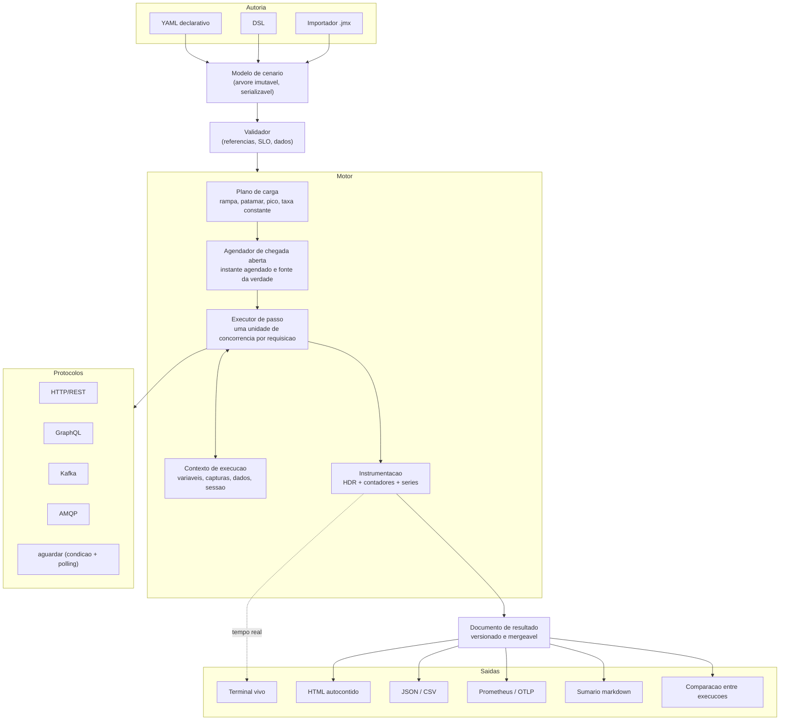
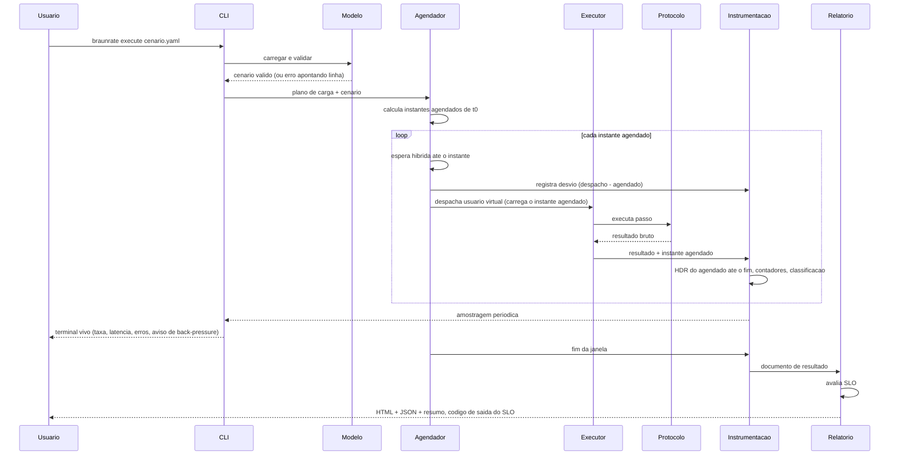
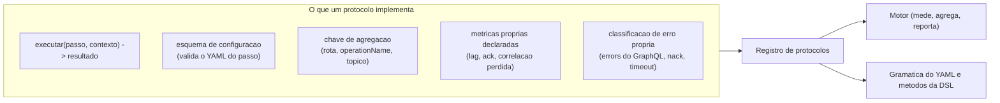
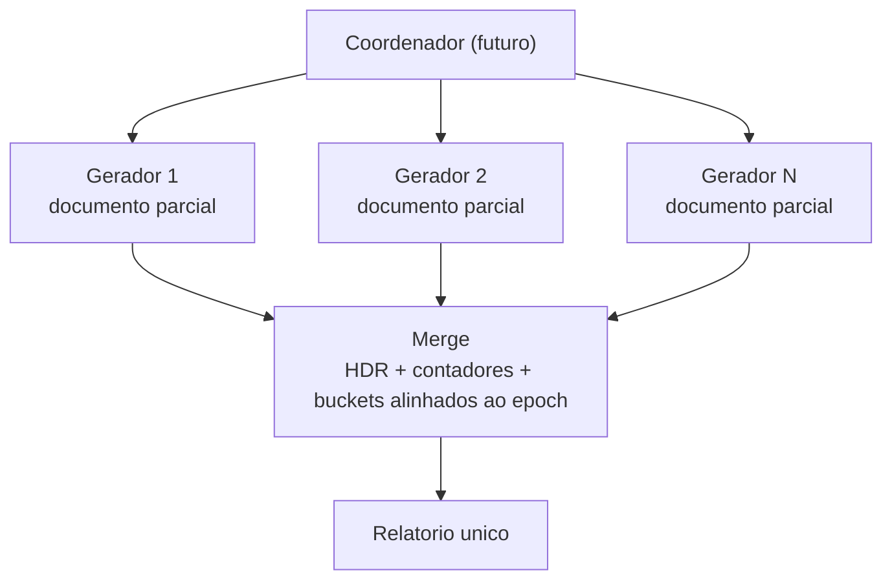

# Arquitetura — esboco da Fase 0

Esboco, nao contrato. O que aqui esta fixo sao as fronteiras que os ADRs [0002](adr/0002-modelo-de-cenario.md) e [0003](adr/0003-modelo-de-execucao-e-metrica.md) tornam obrigatorias: um modelo de cenario unico, medicao no motor, agregados mergeaveis.

## Componentes



Duas fronteiras valem repetir:

- **O protocolo nao mede.** Ele recebe passo e contexto, devolve resultado. Quem cronometra e classifica e a instrumentacao do motor (ADR 0003 §3).
- **A saida nao calcula.** HTML, JSON, terminal e comparacao sao projecoes do documento de resultado. Nenhuma delas recalcula percentil por conta propria (ADR 0003 §6).

## Fluxo de uma execucao



O ponto que nao pode ser negociado: o **instante agendado viaja junto com o usuario virtual** ate a instrumentacao. Se ele ficar so no agendador, a latencia volta a ser contada do envio e a omissao coordenada volta.

## Onde entra um protocolo novo



Um protocolo novo nao toca em: agendador, histograma, formato de resultado, relatorio. Ele declara chave de agregacao e classificacao de erro; o resto e do motor. E o que faz Kafka e HTTP produzirem numero comparavel (estudo §9.3).

O cenario hibrido — `kafka.produzir` seguido de `aguardar` — usa o mesmo contrato: `aguardar` e um protocolo cujo `executar` faz polling ate a condicao ou timeout, e cuja latencia medida e a da cadeia inteira, a partir do instante agendado do proprio passo.

## Estrutura de modulos

```
braunrate/
├── cmd/braunrate/       main, wiring, parse de flags
├── dsl/                 unica API publica: cenario escrito em Go
├── examples/            cenarios .yaml de exemplo
├── docs/
└── internal/            tudo o mais e detalhe de implementacao
    ├── scenario/        modelo, validacao, parser YAML, serializacao
    ├── engine/          plano de carga, agendador, executor
    ├── metrics/         HDR, contadores, series, documento de resultado, merge
    ├── protocol/        registro + http, graphql, kafka, amqp, wait, transport
    ├── messaging/       broker, autenticacao e TLS compartilhados por kafka e amqp
    ├── report/          terminal, html, json, csv, comparison
    ├── correlation/     captura e assercao
    ├── runtime/         valores da iteracao e interpolacao
    ├── auth/            token, basica, cabecalho
    ├── data/            csv com politica de consumo, geracao com semente
    ├── slo/             avaliacao e codigo de saida
    ├── importer/        curl e jmx -> modelo
    ├── recorder/        proxy que grava trafego e escreve cenario
    ├── runner/          cenario -> resultado, unico caminho da CLI e do servidor
    ├── server/          rotas HTTP, sem logica propria
    ├── texto/           plural e contagem nas mensagens
    ├── journey/         testes de ponta a ponta do que o usuario ve
    ├── selfcheck/       provas de honestidade de medicao que rodam no CI
    └── testsupport/     alvo de teste embutido
```

O codigo e escrito em ingles e o produto fala portugues ([ADR 0010](adr/0010-idioma-do-codigo.md)): chave de YAML, mensagem e relatorio continuam como o usuario espera.

`internal/` nao e organizacao: e o compilador impedindo que projeto de fora importe o que nao e contrato publico. So `dsl/` e API para quem usa o braunrate como biblioteca.

Dependencia permitida em uma direcao so: `report` depende de `metrics` e `scenario`; `engine` depende de `scenario`, `metrics` e do registro de protocolos; `scenario` nao depende de ninguem acima.

`metrics` **importa `protocol`**, e isso e deliberado: o vocabulario compartilhado — classe de erro, atributo de resposta, atraso de consumidor — vive no pacote de protocolo e nao pertence a nenhum protocolo em particular. O que continua sendo erro de arquitetura e `metrics` conhecer **um** protocolo: um `import` de `protocol/kafka` ali seria o comeco de metrica especifica, e um teste reprova o build se aparecer.

**Divida quitada em 2026-08-16.** `metrics/variety.go` escrevia a frase de particao do Kafka reconhecendo o prefixo do nome da dimensao, entao havia conhecimento de um protocolo dentro de `metrics` na forma de texto. As duas saidas obvias estavam fechadas: generalizar a frase perde o conselho util ("faca a chave variar por iteracao"), e deixar o protocolo escrever no relatorio contraria o ADR 0003 §3.

A terceira saida: o protocolo declara `protocol.Collapse` junto com a dimensao — o que ela e, o que significa cair num valor so, e o que fazer. A medicao compoe a frase e decide **se** avisa e com que gravidade; ela nao reconhece nome de dimensao nenhum. O dominio atravessa a fronteira como dado, do mesmo jeito que a chave de agregacao e a classificacao de erro ja atravessavam. `TestMetricsDoesNotNameAnyProtocolInItsText` le o texto dos arquivos do pacote e reprova o codigo anterior.

## Preparacao para execucao distribuida

Nao entra na v1 (estudo §3.8), e a arquitetura nao pode impedi-la. O que ja fica pronto:



Requisitos que isso impoe hoje: histograma serializavel e somavel, buckets de serie temporal alinhados ao epoch (nao ao inicio local do processo), plano de carga divisivel por fracao de taxa, e nenhuma media ou percentil pre-calculado no documento parcial.
